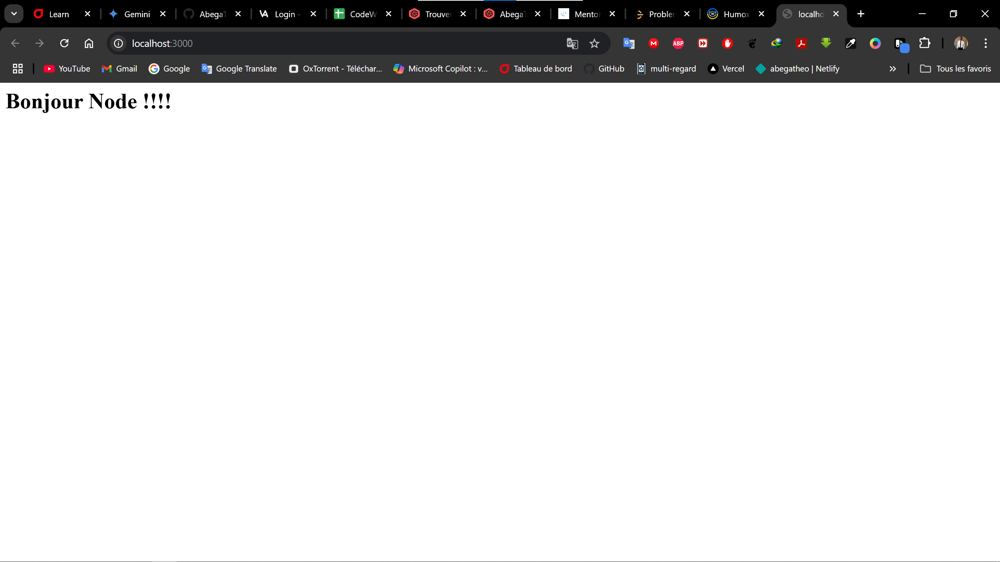
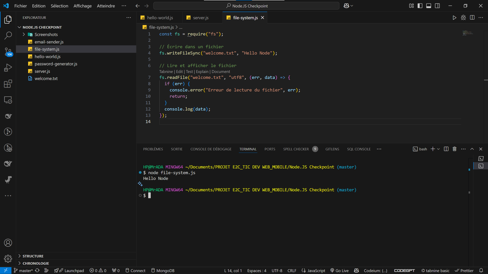
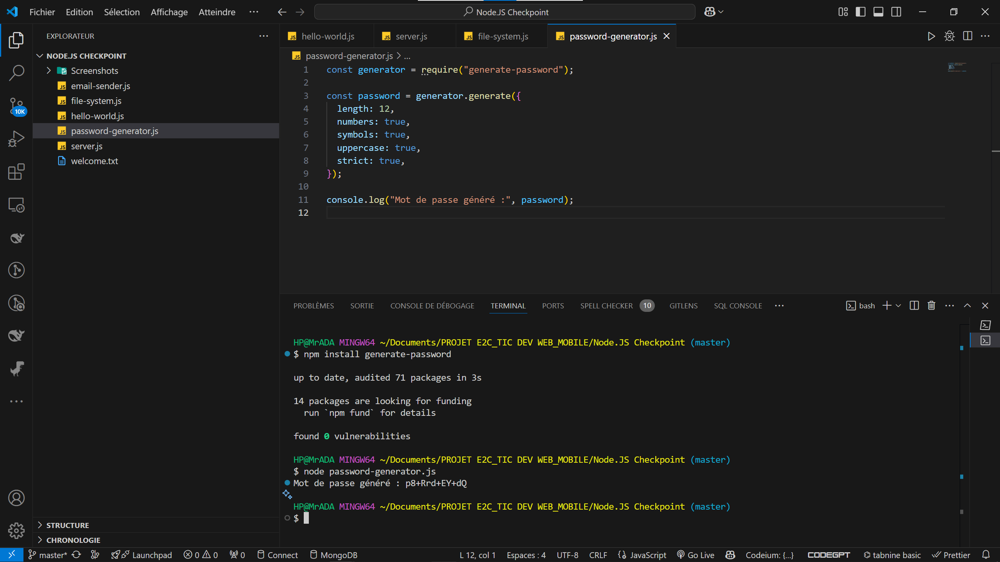
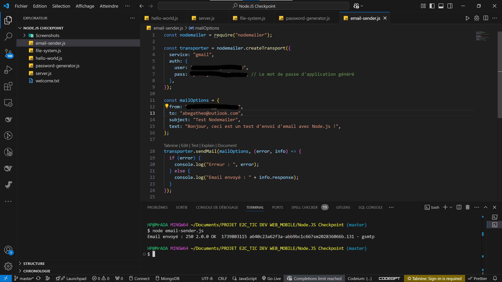

# 🚀 Checkpoint Node.js  

Ce projet contient une série d'exercices pour apprendre et utiliser **Node.js**. Il couvre l'exécution de scripts, la création d'un serveur, la manipulation de fichiers, la génération de mots de passe et l'envoi d'e-mails.  

Voici donc le contenu du projet

---

## 📂 Contenu du Projet  

### 1️⃣ **Hello World**  
- **Fichier :** `hello-world.js`  
- **Commande :**  
  ```bash
  node hello-world.js
  ```
- **Sortie attendue :**  
  ```
  HELLO WORLD
  ```

---

### 2️⃣ **Création d’un Serveur Web**  
- **Fichier :** `server.js`  
- **Commande :**  
  ```bash
  node server.js
  ```
- **Sortie attendue :**  
  ```
  Serveur démarré sur http://localhost:3000
  ```
- **Capture d’écran :**  
  

---

### 3️⃣ **Manipulation des Fichiers**  
- **Fichier :** `file-system.js`  
- **Commande :**  
  ```bash
  node file-system.js
  ```
- **Sortie attendue :**  
  ```
  Hello Node
  ```
- **Capture d’écran :**  
  

---

### 4️⃣ **Génération de Mot de Passe**  
- **Fichier :** `password-generator.js`  
- **Installation du package :**  
  ```bash
  npm install generate-password
  ```
- **Commande :**  
  ```bash
  node password-generator.js
  ```
- **Sortie attendue :**  
  ```
  Mot de passe généré : H4&kdE@pQ8z    // Un exemple de mot de passe généré
  ```
- **Capture d’écran :**  
  

---

### 5️⃣ **Envoi d'E-mail avec Nodemailer**  
- **Fichier :** `email-sender.js`  
- **Installation du package :**  
  ```bash
  npm install nodemailer
  ```
- **Commande :**  
  ```bash
  node email-sender.js
  ```
- **Sortie attendue :**  
  ```
  Email envoyé : 250 OK
  ```
- **Capture d’écran :**  
  

---

## 📸 **Captures d'Écran**  
Toutes les captures d’écran sont stockées dans le dossier **`Screenshots/`** pour illustrer les résultats.

---

## 📌 **Auteur**  
👤 **Abel AGOH**  
📧 Contact : [agohabel4@gmail.com](mailto:agohabel4@gmail.com)    
